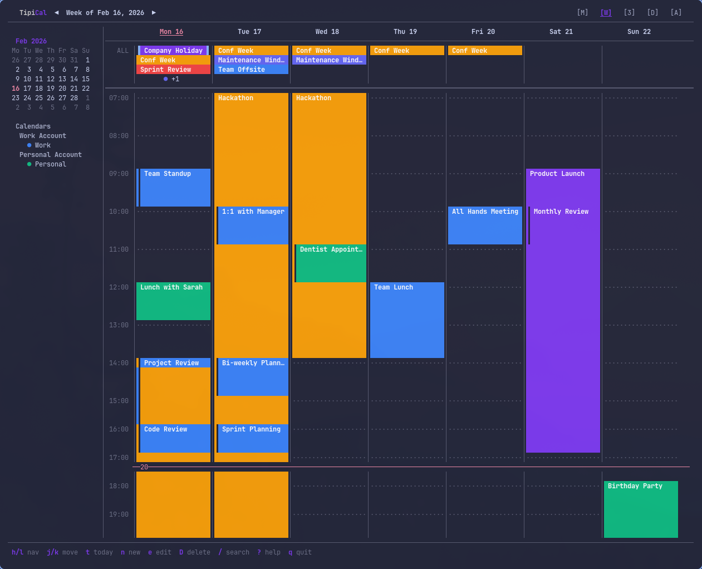
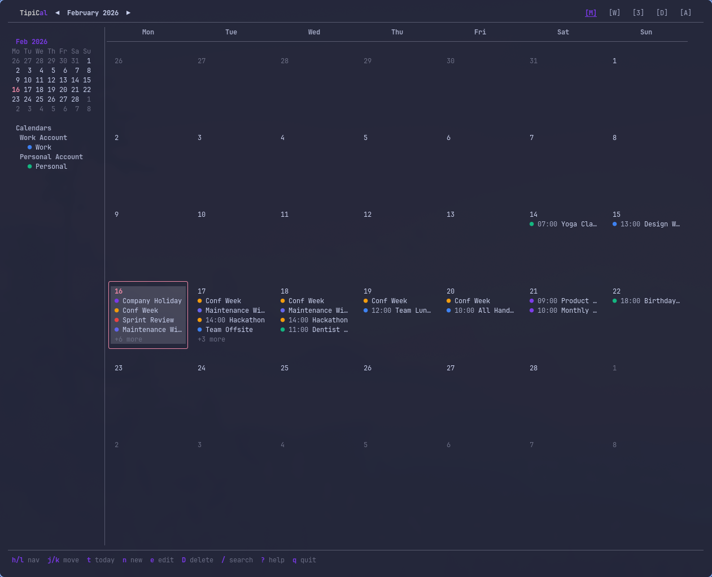
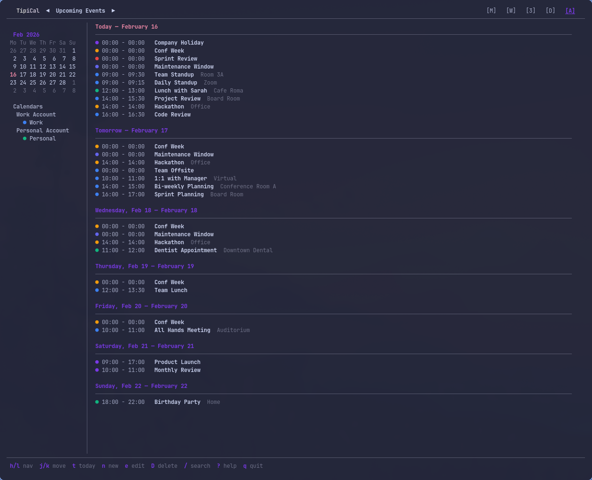
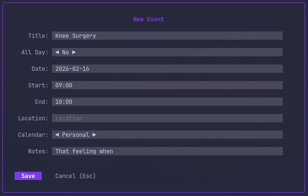
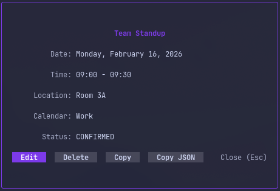
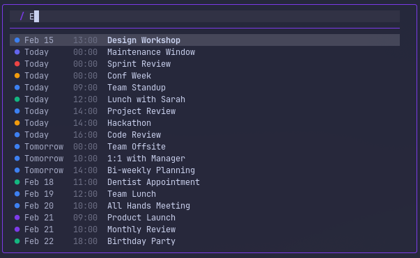

# TipiCal

A fast, beautiful calendar interface for your terminal.



## Features

- **CalDAV Sync** — Connect to any CalDAV server (Nextcloud, Google Calendar, iCloud, etc.)
- **Multiple Views** — Day, 3-day, week, month, and agenda views
- **Rich Event Editor** — Create and edit events with recurrence, reminders, and more
- **Fast Navigation** — Vim-style keybindings and intuitive controls
- **Themeable** — Customizable colors and styling via TOML config
- **Offline Support** — Local cache with background sync











## Installation

```bash
go install github.com/Chromatischer/TipiCal.git
```

Or build from source:

```bash
git clone https://github.com/Chromatischer/TipiCal.git
cd tipical
go build -o tipical
```

## Quick Start

Run the setup wizard on first launch:

```bash
tipical setup
tipical auth add
```

Or start immediately with demo data:

```bash
tipical
```

Configuration is stored in `~/.config/tipical/config.toml`.

### Managing Calendars

After initial setup, you can manage calendars using the `auth` commands:

```bash
tipical auth add      # Add a new calendar
tipical auth list     # List configured calendars
tipical auth test     # Test calendar connections
```


### Command-line access

Beyond the TUI, events can be inspected and managed directly from the shell.
These commands sync with your CalDAV servers and operate on the same cache the
app uses.

```bash
tipical calendars                       # List synced calendars with their ids
tipical events list --days 7            # List the next 7 days of events
tipical events list --from 2026-07-01 --to 2026-07-08 --calendar Privat
tipical events list --search standup --json
tipical events show --uid <UID>         # Show full details of one event
tipical events add --calendar Privat --title "Lunch" \
  --start "2026-07-01 12:00" --end "2026-07-01 13:00" --location "Cafe Roma"
tipical events add --calendar Privat --title "Holiday" --start 2026-07-04 --all-day
tipical events delete --uid <UID>       # Remove an event
```

Dates use `YYYY-MM-DD` for all-day boundaries or `"YYYY-MM-DD HH:MM"` for timed
events, interpreted in your local timezone. `--calendar` accepts a calendar
name or the numeric id shown by `tipical calendars`.

### MCP server

TipiCal can run as a [Model Context Protocol](https://modelcontextprotocol.io)
server over stdio, exposing your calendars to LLM agents such as Claude Desktop
or Claude Code:

```bash
tipical mcp
```

It is launched by an MCP client rather than run interactively. Add it to your
client configuration:

```json
{
  "mcpServers": {
    "tipical": { "command": "tipical", "args": ["mcp"] }
  }
}
```

The server provides read tools (`list_calendars`, `list_events`,
`search_events`, `get_event`) that serve from the local store, and write tools
(`create_event`, `update_event`, `delete_event`) that change the real CalDAV
calendars. Read-only calendars are rejected by the write tools.

## Keybindings

| Key | Action |
|-----|--------|
| `h` `j` `k` `l` | Navigate |
| `n` | New event |
| `Enter` | View/edit event |
| `d` `w` `m` | Day/week/month view |
| `t` | Go to today |
| `/` | Search |
| `q` | Quit |

Press `?` in the app to see all keybindings.

## CalDAV Configuration

TipiCal supports any CalDAV server. Example config:

```toml
[[calendar]]
name = "Personal"
url = "https://nextcloud.example.com/remote.php/dav"
username = "user"
# Prefer password_cmd for security. If you set password, it is stored in plain text.
password_cmd = "pass show caldav/personal"
```

## Security Notes

- If you set `password`, it is stored in plain text in `~/.config/tipical/config.toml`.
- Prefer `password_cmd` to fetch secrets from a password manager.

## License

MIT
